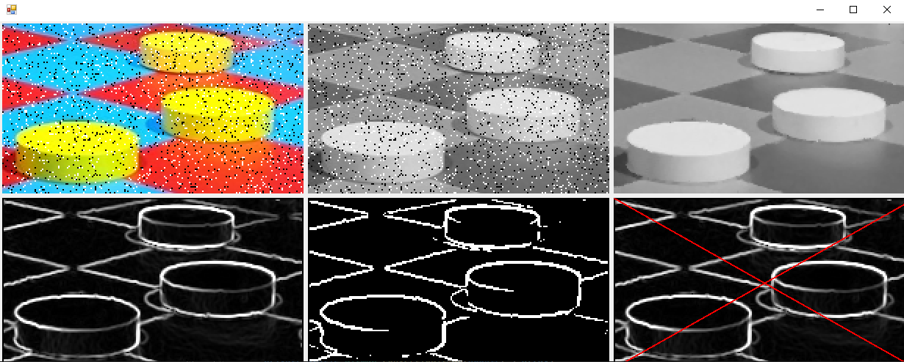

# Image Filters
Этот репозиторий содержит проект, в котором реализованы несколько фильтров для обработки изображений. Каждый фильтр реализован в отдельном файле, и каждый файл содержит задачу, описывающую, что должен делать соответствующий фильтр. Проект был написан исключительно в образовательных целях для выработки навыков работы с изображениями.

## Описание задач
### GrayscaleTask.cs
Переводит цветное изображение в оттенки серого для удобства анализа.

### MedianFilterTask.cs
Применяет медианный фильтр к изображению, чтобы удалить шум. Каждый пиксель заменяется медианой всех пикселей в 1-окрестности этого пикселя.

### ThresholdFilterTask.cs
Преобразует изображение в черно-белое, используя пороговое преобразование. Заменяет пиксели со значением больше либо равному порогу T на белый (1.0), а остальные на черный (0.0).

### SobelFilterTask.cs
Выделяет границы объектов на изображении, используя фильтр Собеля. Он определяет разницу интенсивности пикселей вдоль горизонтальной и вертикальной осей и использует эту информацию для определения границ объектов.

# Использование
Каждый фильтр можно использовать отдельно, вызвав соответствующий метод. Также есть возможность использовать все фильтры последовательно, чтобы получить изображение, прошедшее через все преобразования.

# Скриншоты

